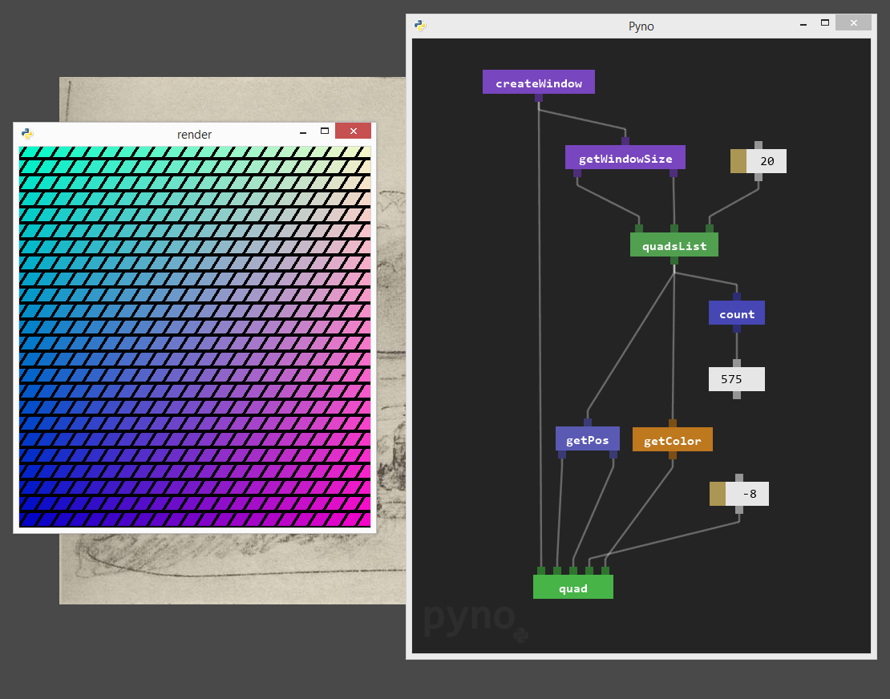

# Pyno
**Python-based data-flow visual programming**, what?


*Pyno is an experiment. Real world scenarios is confusing.*

### How to use
**Basics:**

There are only two elements:
- **node** (is a function)
- **field** (is a object, value or lambda function)

Controls:
- Use right-mouse-button to panning.
- To spawn node press **N**, to spawn field press **F** on keyboard.
- Save and load pyno-file using bottom-right buttons (S-save, L-load).
- Move and select elements by mouse, selected elements can be deleted by **Delete** key.
- Selected elements can be **ctrl-c** and **ctrl-v**.
- Nodes has a code inside, edit code just by pressing on node and hover code editor.
- Last, you want to transfer data from element to element, just press and hold on pin and drop connection to other pin.


[Check wiki for advanced tutorials!](https://github.com/honix/Pyno/wiki)

### How to run
To run pyno you must install few libs:

*(type this commands to your command line)*

* ```pip install pyglet```
* ```pip install clipboard```

Make sure you have Python 3.4 or better on your computer. If true then run **Pyno.py**


