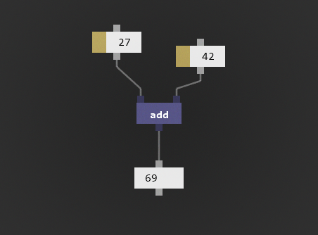

# Pyno
**Python-based visual programming**, what?



*Pyno is a experiment. Real world scenarios is confusing.*

### How to use
There are only two elements:
- node (is a function)
- field (is a object, value or lambda function)

1. To spawn **node** press **N**, to spawn **field** press **F** on keyboard.

2. To open already created pathes copy *(ctrl + c)* text from examples and paste *(ctrl + v)* it in pyno window. For now it is only one way to do.

3. You can move and select elements by mouse, selected elements can be deleted by **Delete** key.

4. Any node has a code inside, edit code just by pressing on node and hover code editor.


5. Last, you want to transfer data from element to element, just press and hold on pin and drop connection to other pin.

### How to run
Make sure you have Python 3.4 on your computer. If true then run **__main.py**

### Dependencies
To run pyno you must install few libs:

*(type this commands to your command line)*

* ```pip install pyglet```
* ```pip install clipboard```
